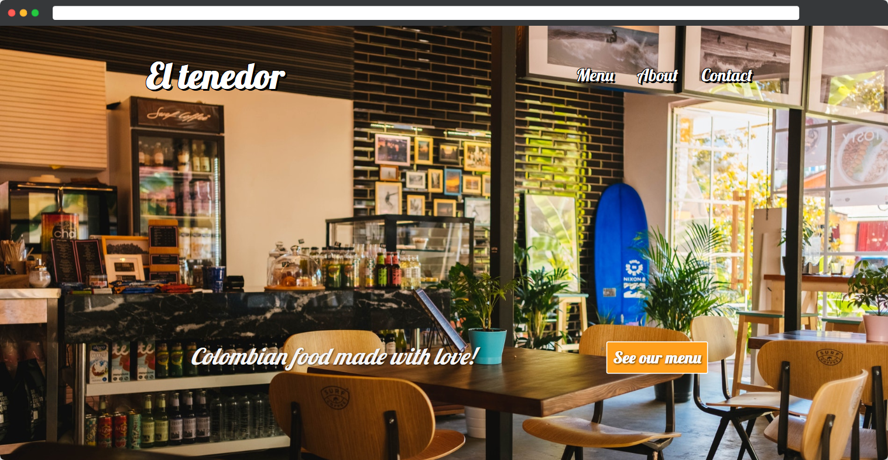

# Colombian Restaurant Website

Single page website to showcase a restaurant's products and services.



## Js-Rest [Live Link](https://eltenedor.netlify.app/#)

## Usage
> Clone the repository to your local machine using ssh:

```
git clone [git@github.com:rOluochKe/JS-TicTacToe.git](https://github.com/leonmezu1/Js-Rest.git)
```

> Clone the repository to your local machine using https:

```
git clone [git@github.com:rOluochKe/JS-TicTacToe.git](https://github.com/leonmezu1/Js-Rest.git)
```
> cd into the directory

```
cd Js-Rest
```

> Run Server Locally

## Functionalities

- Beautiful Restaurant Web Page
- Vanilla Javascript
- Bootstrap user friendly interface

## Designed and developed by

[Leonardo Mezu](https://github.com/leonmezu1)
